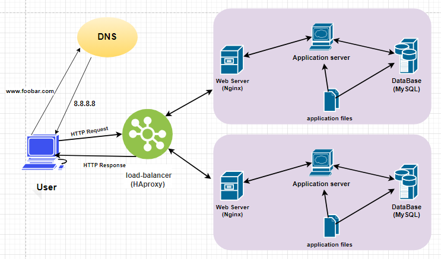

## Description :

Design a three server web infrastructure that hosts the website www.foobar.com.

* Requirements:

+ 2 servers
+ 1 web server (Nginx)
+ 1 application server
+ 1 load-balancer (HAproxy)
+ 1 set of application files (your code base)
+ 1 database (MySQL)

## Explanations :

1. **Load Balancer (HAproxy)**:
   - **Purpose**: The load balancer distributes incoming HTTP requests across multiple servers to ensure optimal utilization of resources and improve reliability and availability.
   - **Distribution Algorithm**: Round-robin algorithm is configured on the load balancer, which evenly distributes requests in a sequential order to each server in the backend pool.
   - **Active-Passive Setup**: The load balancer is configured in an Active-Passive setup, where only one instance (active) is actively handling traffic while the other instance (passive) remains on standby to take over in case of failure. This setup ensures high availability and failover capability.

2. **Web Server (Nginx)**:
   - **Purpose**: Nginx acts as the web server responsible for serving static content and forwarding dynamic requests to the application server. It provides high-performance and efficient handling of HTTP requests.
   - **Additional Element**: The web server is added to offload the application server from serving static content, improving overall performance and scalability.

3. **Application Server**:
   - **Purpose**: The application server executes server-side logic, processes dynamic content, and interacts with the database server. It runs the business logic of the web application.
   - **Additional Element**: The application server is added to handle application-specific tasks separately from the web server, ensuring better resource utilization and scalability.

4. **Database (MySQL)**:
   - **Purpose**: MySQL serves as the database server responsible for storing and managing application data. It provides data persistence and ensures data integrity and reliability.
   - **Primary-Replica (Master-Slave) Cluster**: The database is configured as a Primary-Replica (Master-Slave) cluster, where the Primary node handles write operations (inserts, updates, deletes) while the Replica nodes replicate data from the Primary node and handle read operations. This setup improves performance and fault tolerance.

## Issues:

1. **Single Points of Failure (SPOF)**:
   - The load balancer and each server can potentially become single points of failure if they fail, leading to service disruptions or downtime.
   
2. **Security Issues**:
   - Lack of firewall configurations exposes the infrastructure to security threats and unauthorized access.
   - Absence of HTTPS encryption leaves the communication between clients and servers vulnerable to interception and data breaches.

3. **No Monitoring**:
   - Without monitoring tools in place, it becomes challenging to detect and address performance issues, resource utilization, and potential failures proactively.

