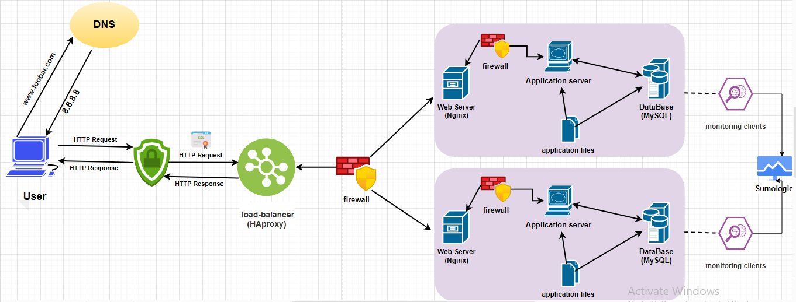

## Description :

a three server web infrastructure that hosts the website www.foobar.com, it must be secured, serve encrypted traffic, and be monitored.

* Requirements:

+ 3 firewalls
+ 1 SSL certificate to serve www.foobar.com over HTTPS
+ 3 monitoring clients (data collector for Sumologic or other monitoring services)
+ For every additional element, why you are adding it
+ What are firewalls for
+ Why is the traffic served over HTTPS
+ What monitoring is used for
+ How the monitoring tool is collecting data
+ Explain what to do if you want to monitor your web server QPS

## Explanations :

1. **Firewalls**:
   - **Purpose**: Firewalls are added to control and monitor incoming and outgoing network traffic to and from the servers. They act as a barrier between the internal network and external networks, preventing unauthorized access and protecting against potential security threats.
   - **Additional Element**: Three firewalls are added for redundancy and to ensure comprehensive protection of the infrastructure.

2. **SSL Certificate (HTTPS)**:
   - **Purpose**: An SSL certificate is installed on the web server to enable HTTPS encryption for traffic between clients (web browsers) and the website www.foobar.com. HTTPS ensures secure communication by encrypting data transmitted over the network, preventing eavesdropping and tampering by malicious actors.
   - **Additional Element**: The SSL certificate is essential for securing sensitive information, such as user credentials, payment details, and other personal data, transmitted between clients and the web server.

3. **Monitoring Clients (Data Collector)**:
   - **Purpose**: Monitoring clients are deployed on each server to collect performance metrics, logs, and other data related to the server's health and activity. This data is then sent to a centralized monitoring service (e.g., Sumo Logic) for analysis and alerting.
   - **Additional Element**: Three monitoring clients are deployed for redundancy and to ensure comprehensive monitoring coverage across all servers in the infrastructure.

## Specifics:

- **Why Firewalls?**: Firewalls are essential for controlling and monitoring network traffic, protecting the infrastructure from unauthorized access and security threats.
- **Why HTTPS?**: HTTPS ensures secure communication between clients and the web server by encrypting data transmitted over the network, preventing eavesdropping and tampering by malicious actors.
- **Why Monitoring?**: Monitoring is used to track the performance, health, and activity of servers in real-time, identify potential issues or bottlenecks, and proactively address them to maintain optimal performance and availability.
- **How Monitoring Works?**: Monitoring clients collect performance metrics, logs, and other data from servers and send it to a centralized monitoring service (e.g., Sumo Logic) for analysis and alerting.
- **Monitoring Web Server QPS**: To monitor the web server's QPS (Queries Per Second), you can configure the monitoring tool to track incoming HTTP requests and calculate the rate at which requests are received over a specific time period.

## Issues:

- **Terminating SSL at the Load Balancer Level**: Terminating SSL at the load balancer level can be an issue because it requires decrypting and re-encrypting traffic, adding overhead and potentially introducing security risks.
- **Single MySQL Server for Writes**: Having only one MySQL server capable of accepting writes can be a single point of failure and a scalability bottleneck, limiting the system's ability to handle high write loads and increasing the risk of data loss or downtime.
- **Homogeneous Server Components**: Deploying servers with all the same components (database, web server, and application server) can be a problem because it lacks redundancy and resilience. If one component fails, it can affect the entire server, leading to service disruptions or downtime.
