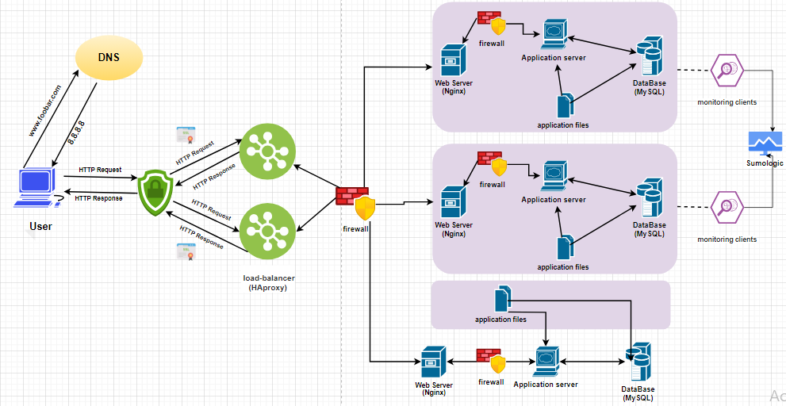

## Description : 

In a typical deployment, a website that provides both static and dynamically generated content runs web servers for the static content and application servers to generate content dynamically. A reverse proxy and load balancer sit in front of one or more web servers and one or more web application servers to route traffic to the appropriate server, first based on the type of content requested and then based on the configured load-balancing algorithm. Most load balancer programs are also reverse proxy servers, which simplifies web application server architecture.

* Requirements:

+ 1 server
+ 1 load-balancer (HAproxy) configured as cluster with the other one
+ Split components (web server, application server, database) with their own server
+ For every additional element, why you are adding it

## Explanations :

1. **Server 1**:
   - **Purpose**: This server hosts components of the web infrastructure, including the web server, application server, and database.
   - **Additional Element**: Server 1 is added to host the various components separately, allowing for better resource allocation, scalability, and fault isolation.

2. **Load Balancer (HAproxy)**:
   - **Purpose**: The load balancer distributes incoming traffic across multiple servers to improve performance, reliability, and scalability.
   - **Cluster Configuration**: HAproxy is configured as a cluster with another load balancer for high availability and fault tolerance. This setup ensures continuous operation even if one load balancer fails.

3. **Web Server**:
   - **Purpose**: The web server handles incoming HTTP requests, serves static content, and forwards dynamic requests to the application server.
   - **Split Component**: The web server is deployed on its own server to separate concerns and optimize performance.

4. **Application Server**:
   - **Purpose**: The application server executes server-side logic, processes dynamic content, and interacts with the database.
   - **Split Component**: The application server is deployed on its own server to isolate application logic and resources from the web server and database.

5. **Database**:
   - **Purpose**: The database stores and manages application data, providing data persistence and reliability.
   - **Split Component**: The database is deployed on its own server to separate data storage and processing from the web server and application server.

## Specifics:

- **Why Add Server 1?**: Server 1 hosts the web server, application server, and database separately to improve resource allocation, scalability, and fault isolation.
- **Why Add Load Balancer?**: The load balancer distributes incoming traffic across multiple servers to improve performance, reliability, and scalability. Configuring HAproxy as a cluster with another load balancer ensures high availability and fault tolerance.
- **Why Split Components?**: Deploying the web server, application server, and database on separate servers isolates resources, improves scalability, and enhances fault tolerance.

